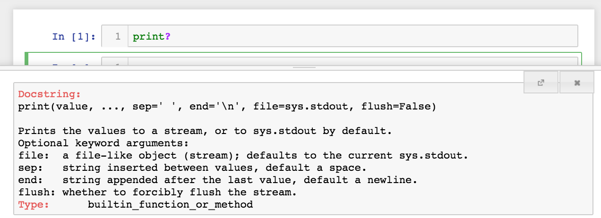
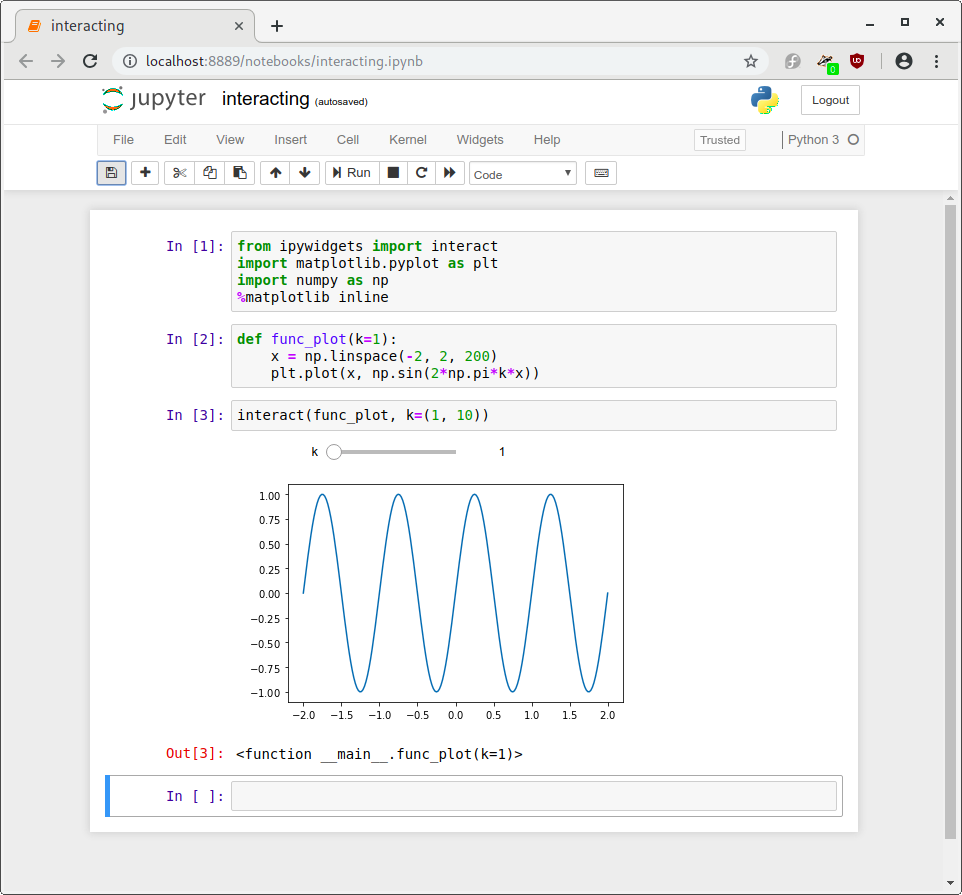
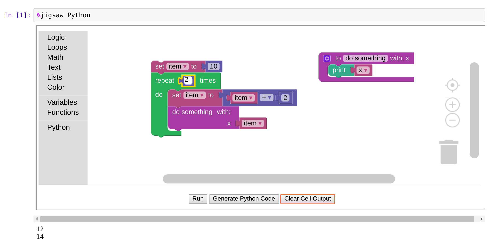
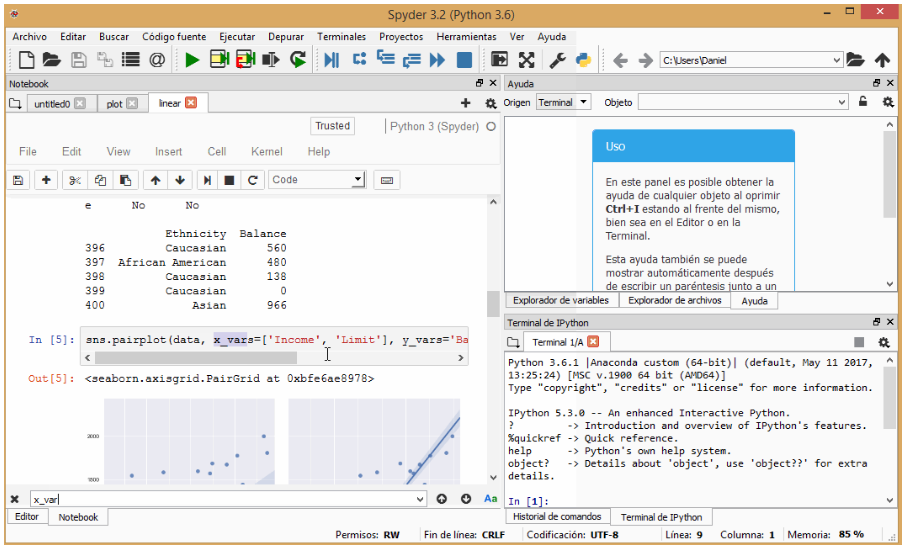

# Jupyter Notebook ecosystem {#jupyter}

## Language support: kernels

The Jupyter system supports over 100 programming languages (called
"kernels" in the Jupyter ecosystem) including Python, Java, R, Julia,
Matlab, Octave, Scheme, Processing, Scala, and many more.  Out of the
box, Jupyter will only run the IPython kernel, but additional kernels
may be installed. Language support continues to be added
by the open source community and the best source for an up-to-date list is the wiki page maintained by the project: 
[https://github.com/jupyter/jupyter/wiki/Jupyter-kernels](https://github.com/jupyter/jupyter/wiki/Jupyter-kernels).
These projects 
are developed and maintained by the open source community and exist in
various levels of support. Some kernels may be supported
by a vast number of active (and even paid) developers, while others
may be a single person's pet project. When trying out a new kernel, we
suggest exploring a kernel's community of users and documentation to
see if it has an appropriate level of support for your (and your
students') use.

Jupyter's kernel flexibility allows instructors to pick the right
language for a particular context.  For example instructors may use
Python to teach programming, while switching to R to teach statistics,
and then perhaps Scala to teach big-data processing. Regardless of the
language chosen, the Jupyter interface remains the same. Thus, some
cognitive load can be lessened when using multiple languages within or
across courses (e.g., the user interface stays the same between
the student's Digital Humanities and Biology courses). 
Students often appreciate consistent use of the same language within a course, however.

## Using Jupyter notebooks

When using Jupyter notebooks on the data projector or large screen
monitor in the classroom, we recommend giving the students specific
instructions on the meaning of the user interface of the notebook. It
is not exactly intuitive.

The first and most salient component of the notebook is the
*cell*. Indeed, the entire contents of a notebook is composed of
only cells. These cells can take one of two forms: text or code. We
will descibe the authoring of a notebook in the following section;
however, here we identify some of the subtle, yet important components
of a code cell.

Code cells are composed of three areas: the **input** area, the
**display** area, and the **output** area. The input area is identified by
the `In []:` prompt to the left of the cell. Between the brackets of
the `In` prompt can be one of three items: a number, an asterisk, or a
blank. A number indicates that this cell has been executed and the
value of the number indicates the order of execution. For example,
normally, after you execute the first cell after opening a notebook,
its prompt will read `In [1]:`.

```{block2, type='rmdnote'}
<strong>Pro Tip</strong>

When teaching with notebooks, you often will want to refer to a cell
my name. You could refer to a cell by its input prompt
number. However, keep in mind that this number will change if you
excecute the cell again, or that students may have different numbers
if they, too, are executing their own copy of the notebook. A better
way of referring to a cell may be to refer to the text right above the
cell as that won't change while you execute cells. For referring to
lines of code, see the following section on Tips and Tricks.
```

Before executing a cell, the input prompt number area will be
blank. Therefore, you can tell at a glance that that cell has not been
executed yet. It may also be the case that if an input prompt does
have a number in it, then the cell has been run in the past.  However,
the cell may not have been run during this session, and thus the
output may be showing old results. We recommend running from the menu:
`Cell`, `All outputs`, `Clear` at the beginning of a
presentation. That initializes all cell inputs to the blank state.

During the execution of a cell, the input prompt will contain an
asterisk. If it seems that too much time has passed and you still see
`In [*]:` your code may be in an infinite loop, or you have lost
communication with the kernel. You may have to interrupt or restart
the kernel. This is discuss below.

Finally, it is important to keep separate the display and output areas
below the input cell. The difference between these two areas is subtle
and confusing, but is very important in some instances. The display
area is reserved for any item that code has produced for viewing. That
includes simple text (i.e., `print("hello, world")`) or figures from a
plot. The output area is reserved for items that the cell "returns."
This is why in many notebooks you may see a variable assignment
followed immediately by the variable, like this:

```python
x = 2434 + 33476
x
```

In this example, you wouldn't actually see the value computed unless
you print it to the display area, or return the value. Here, we return
it as the last value of the cell.

```{block2, type='rmdimportant'}
Keep in mind that the bottom portion of the notebook on the screen or
monitor may not be visible to students in the back of the room. Make
sure that the font size is large enough, and that you don't go too fast
when demonstrating code that students don't have access to. We also
recommend that you hide the Jupyter toolbar and header to get more
room for the actual notebook (select `Toggle Header` and `Toggle View`
under the Jupyter `View` menu).
```

## Authoring Jupyter notebooks


Before embarking on writing notebooks for your course, we recommend
that you look around on the internet for related courses. 
A similar course for which an instructor has already generated
notebooks could exist for you to use or adapt for your course. 
Notebook authors often are happy to collaborate on open source
educational resources or have their resources be used by other
instructors. The following sections focus on Python
simply because it is currently the language with the largest Jupyter
feature support.


### Accessing documentation in the notebook  {#accessing-documentation-in-the-notebook}

One of the best features of quality libraries is their documentation,
which students and other users will likely consult regularly. From a
notebook cell, the TAB key autocompletes (or gives completion tips)
and SHIFT-TAB brings up full documentation. Similarly, using a
question-mark after a method or function will bring up the
documentation after the cell is run, as shown in Figure 5.1.




Using this feature in class during live coding or
while explaining how code works helps make students comfortable
of working effectively with libraries.


### Widgets {#widgets}

Widgets provide the opportunity for learners and instructors to
interact with code outputs, such as charts and tables.
Widgets are "mini"
Graphical User Interfaces (GUI) that give the notebook user access to
slide bars, toggle buttons, and text-boxes. They can be used in
conjunction with code, allowing a change of mindset from programming
as a primary goal to exploring a model or computation as the primary
goal. Alternatively, the code can be hidden and the widgets used to
create a notebook "app" that might connect input parameters with a
simulation and a plot.

Currently, only a small subset of kernels have widget
functionality. The reference implementation of widgets
are the Jupyter-Python widgets
([https://ipywidgets.rtfd.io](https://ipywidgets.rtfd.io)). It
includes widget components to generate and display sliders, progress
bars, text boxes, check boxes, toggle buttons, etc. Many popular
visualization tools, such as Matplotlib, Plotly, leaflet.js, three.js,
have Jupyter-Python widget implementations. The documentation contains
an up-to-date list of all of the widgets and their
variations. The `interact` method allows you to
wrap a function, which might be a simple computation or a complex
simulation that produces a plot, and provides widgets for each of the
inputs to the function. Figure 5.2 shows a simple example of a sinusoid
plot whose frequency is controlled by a slide-bar. Another kernel that
has some widget functionality is C++
([https://github.com/QUantStack/xwidgets](https://github.com/QUantStack/xwidgets)).




In addition to the IPywidgets library, the ipyleaflet library
(https://ipyleaflet.rtfd.io) displays an interactive map in a notebook.

#### Example {-}


```
from ipyleaflet import Map
Map(center=[34.6252978589571, -77.34580993652344], zoom=10)
```


For the ambitions reader, there are resources available for you to
write your your own custom widgets. The widget cookie cutter project
([https://ipywidgets.rtfd.io](https://ipywidgets.rtfd.io)) is a good
place to start.


### Magics {#magics}

Magics are meta-commands that only function within Jupyter and allow a
user to access language/kernel-specific features. For instance, the
IPython kernel provides a number of magics that can be useful while
developing Jupyter notebooks using Python as the primary
language. These are
[documented](https://ipython.readthedocs.io/en/stable/interactive/magics.html)
and we will only call out a few of these here. Many other magics are
available for different kernels but they are specific to Jupyter so
may not be usable in a stand-alone script in that language outside of
Jupyter.  In some instances, you may want to use magics sparingly to
avoid obfuscating these meta-commands with the actual commands in the
language you are teaching. Magics always begin with either a single
`%` for single-line commands or with `%%` for applying a command to an
entire cell. Some magics can be used with single or double `%`, but
some cannot.

#### Examples {-}

  *  Matplotlib is a common choice for visualization. In Jupyter, the
     magic `%matplotlib` allows the resulting figures to
     be displayed in the notebook: `%matplotlib inline` produces
     static images embedded in the notebook, and `%matplotlib
     notebook` produces interactive images (with zooming, panning, etc.).
     
  * The `%run` magic allows running external scripts (and other
     notebooks), captures output and displays it in the notebook,
     e.g., `%run my_script.py`. The `%run` magic is one answer to "how
     do I import one notebook into another?"

  *  The `%time` magic times the execution of the Python expression following it, e.g., `%time sum(range(1000))`.

  * The `%timeit` magic is similar to `%time`, but it
    runs the expression multiple times and reports the average
    execution time.

  * The `%reset` magic deletes all user-defined variables along with input and
    output.  Magics often have "flags," following the Unix command
    pattern. For example, `%reset -s` is a soft reset and only removes
    user-defined variables. These commands can be useful to avoid problems
    with out-of-order execution problems.

  * The `%debug` magic is used after code has stopped due to an
    exception (i.e., "the program has crashed"). Enter the `%debug`
    magic immediately after the crash, and you will be placed into the
    environment that caused the problem. From there you can explore
    variables and find the cause of the problem.


A good example of a magic operating on the entire contents of cell is
the `%%HTML` magic, forcing the cell to be interpreted as HTML
and rendered appropriately. You can also use magics to call other
languages while running the IPython kernel.  For example, you can run
R code from within an IPython notebook by using the `%%R` magic.

```{block2, type='rmdnote'}
<strong>Pro Tip</strong>

In the IPython kernel you can also use the `%shell` magic. This is
often abbreviated as `!` and can run and return results from the
shell/terminal. In IPython, you can also mix magics with regular
Python code. For example, `files = ! ls` will use the `ls` (list
files) command in the terminal, return the list, and set the
Python variable `files` to that list.
```

### Notebooks under version control {#notebooks-under-version-control}

Keeping notebooks under version control is a great way to not only
keep track of changes to your content, but also for
sharing it. In a course where multiple people are contributing
to the development of notebooks for the course, using version control
in conjunction with a platform like GitHub, allows authorship to be
tracked and provides communication tools for reviewing new
contributions or outlining requested development for a new assignment,
activity, etc.  Another advantage of using version control is that
some services will provide rendered views of notebooks
that you have made public. GitHub shows a rendered
version of the notebook, rather than the ASCII text that a notebook is
comprised of.  Some pitfalls with LaTeX rendering may occur,
as platforms do not always render the notebooks the same as they would
appear in an active Jupyter interface.

We should mention a few caveats to keeping notebooks under version control.
The code output, including images, is stored
in the repository, unless you clear the output
before committing changes.  This can make reviewing changes difficult,
as changes in output will be detected even when nothing has actually
changed content-wise.  The tracked notebooks also can become large if
output is tracked.  Even when clearing the output, reviewing
changes can be awkward due to the format of the notebook (notebooks
are plain-text files and the file format is represented as
[JSON](https://www.json.org/)). 
The community is actively developing tools to make it easier to use version control with Jupyter notebooks; one such tool is `nbdime` (see box).

```{block2, type='rmdnote'}
<strong>nbdime</strong> <a href="https://nbdime.readthedocs.io/">nbdime.readthedocs.io/</a>

nbdime includes a set of tools for reviewing the changes ("diffs") and
merging changes in Jupyter notebooks. You can compare versions of a
notebook using the terminal, view the changes richly rendered on a
browser, and merge in various ways. Because nbdime understands the
structure of notebook documents, it can make smart "diffing and
merging" decisions.
```

Another option to improve your version-control experience is to export
a Jupyter notebook to a markdown document, for example using the [jupytext](https://github.com/mwouts/jupytext) tool.
Then you can review diffs in the usual way for plain-text files.


### Testing notebooks {#testing-notebooks}

Before distributing notebooks, and in particular if you are working
with multiple contributors to the course material, testing the
notebooks before they are distributed to students or used in a live
demo can help mitigate unexpected bugs. At a minimum, you can test
that the notebook executes cleanly from top to bottom by restarting
the kernel and running all cells from top to bottom. This can be done
from the menu (Restart + Run all).

Though it requires a bit more setup, tests can be run automatically
using a continuous integration service, such as TravisCI
([https://travis-ci.org](https://travis-ci.org)). This will require
executing the entire notebook via the command line, for example
`jupyter nbconvert --ExecutePreprocessor.enabled=True --to=html
my_notebook.ipynb` will execute the notebook (same as pressing
"Restart + Run All") and then convert it to HTML. These services can
be connected to GitHub so that any time that the notebooks are
changed, the tests are run automatically. Simplifying this process is
an area that is under development in the open source community. The
package
[https://github.com/opengeophysics/testipynb](https://github.com/opengeophysics/testipynb)
provides an easy way to test notebooks.


### Essential Python libraries  {#essential-python-libraries}

The purpose of this section is to introduce some of the most widely
used packages within the Python ecosystem. As mentioned before, over 100 kernels enable different programming languages in Jupyter. 
But Python is a common choice in many disciplines, due to its
large open-source community which develops and maintains an ecosystem of over 150,000 software packages.

The core Python library
([https://docs.python.org](https://docs.python.org/3/)) contains basic data
types such as lists and dictionaries, as well as core functionality
such as arithmetic operators and simple file parsers. Most tasks can
be achieved with core Python. They are often made easier, however, with
higher-level libraries. This particularly applies for
scientific computing with Python. 
Among the vast number of packages in the Python ecosystem, NumPy,
Scipy, Matplotlib and Pandas are among the most commonly used. 
A good resource for getting familiar with these libraries
is the **Scipy Lecture Notes** [https://www.scipy-lectures.org](https://www.scipy-lectures.org).

* Numpy
([http://www.numpy.org/](http://www.numpy.org/)) is a fundamental
library for numerical and scientific computing with Python. It
contains data structures for numerical arrays, tools for linear
algebra, random number capabilities, and much more. 
* SciPy
([https://docs.scipy.org/](https://docs.scipy.rg/)) offers a
varied set of functions for scientific computing, such
as optimization, interpolation, statistics and signal processing. It
also includes fundamental constants from many disciplines such as the
speed of light as well as data structures for sparse
matrices. 
* Matplotlib
([https://matplotlib.org/](https://matplotlib.org/)) is the core
plotting library for Python and can be used inline in the notebook
with the `%matplotlib notebook` or `%matplotlib inline` cell
magics. 
* Pandas
([https://pandas.pydata.org/](https://pandas.pydata.org/)) provides
resources for data analysis and a flexible data structures for labeled tabular data. 


### Advanced topic: extensions {#advanced-topic-extensions}

There are many community contributed extensions that add functionality
to Jupyter notebooks.  Extensions vary from displaying an automated
table of contents for a notebook, or prettify code, or hiding/showing
solution cells.  Here is the link for how to install and enable
extensions:
[https://jupyter-contrib-nbextensions.readthedocs.io/en/latest/install.html](https://jupyter-contrib-nbextensions.readthedocs.io/en/latest/install.html)

Here is a list of a collection of extensions that are bundled
together:
[https://jupyter-contrib-nbextensions.readthedocs.io/en/latest/nbextensions.html](https://jupyter-contrib-nbextensions.readthedocs.io/en/latest/nbextensions.html)

Creating custom extensions is a way to extend or customize Jupyter to
add a capability that is not currently available with current
extensions or out of the box. These extensions may be targeted for a
specific kernel.  Here are instructions for how to create and install
custom extensions:
[https://jupyter-notebook.readthedocs.io/en/stable/extending/frontend_extensions.html](https://jupyter-notebook.readthedocs.io/en/stable/extending/frontend_extensions.html)

Figure X shows shows how Google Collaboratory, one of many tools to
interact with Jupyter notebooks, leverages the power of Jupyter
extensions for custom interaction and presentation.


The set of extensions for Jupyter is constantly evolving. Educators
are exploring new and interesting methods of using notebooks in
pedagogy. While the list of current extensions is far too long to
list, you can interactively experience some of the most useful
extensions through this live
[Binder notebook](https://hub.mybinder.org/user/psychemedia-showntell-eii7j2nh/notebooks/index_computing.ipynb)
(Binder is described in detail in the following chapter).
This live notebook demonstrates the following:

* Turning on line numbers in code cells (makes it easier to refer to a line of code)
* Code folding extension (hide code blocks to help focus attention)
* Locked and frozen cells extension (prevent changes to cells)
* An extension for a better user interface for error messages
* A "turtle" extension (draws in a canvas in the notebook)
* Block-based programming extension

The block-based programming extension (called Jigsaw) allows users to
program using drag-and-drop blocks of code that can be integrated with
other cells in a Jupyter Notebook (see figure). The advantages (and
disadvantages) of blocked-based languages are active research topics
in computer education research (see, for example, Mark Guzdial's
excellent [Computing Education Research Blog](https://computinged.wordpress.com/),
specifically [those posts on block-based languages](https://computinged.wordpress.com/tag/blocks-based-language/)).



## Tips and tricks


### Reminders

If you are using a single notebook as a standalone exercise in a
traditional class (i.e., this is the only computational component of
your class), then it is helpful to have a few cells at the top of that
notebook that reviews how to navigate through the notebook and how to
insert cells, etc.


### Feedback

How do we get feedback from students in an interactive session to see
if students have completed an exercise?

A low tech solution is to give students sticky notes of different
colors, one meaning "finished" and one meaning "need help", that they
can stick on the back of their computers. The instructor can then
quickly look up to take a survey of the state of the class and decide
how to proceed.

Projecting Slack or a similar chat group on a screen and having
student copy-paste solutions (provided they are short functions) is a
nice way to let everyone in the class see one another's solutions.  A
positive aspect of having multiple student solutions projected is that
it can show the variety of ways to solve a problem. This gives an
opportunity to talk about the readability of solutions and their
efficiency. A downside is that in a large class, the shear volume of
posts can make it overwhelming. Instead polling can be used to
aggregate student answers and provide some form of feedback to the
instructor. Nbgrader or travis-CI can also be options here, requiring
students to submit completed code where it is assessed
automatically. These will however require more setup and can take some
time to complete.


### Explaining each cell

Consider moving the comments for a code block into a markdown cell
either directly above or below the code cell. Comments in a markdown
cell often read much better and give you more flexibility in
discussing or describing the code. However, short comments in a block
of code can still be useful.


### How to structure code cells

How much code should you put in a cell? You will develop your own
style of writing noteooks with experience. Typically, you will want to
keep the number of lines low so that it is easy to follow, and you can
have useful comments above the cell. However, we recommend putting
code that "goes together as a meaningful unit" into a single cell. For
example, if you have lines of code that are highly dependent on each
other, then you might want to put them together. As an example,
consider two lines of code: one that opens a file, and the second that
reads the data from the file. It is probably a good idea to put those
into the same cell so that they are always executed
together. Otherwise, the student may encounter errors if they execute
cells independently a second time (e.g., there are no more data).

Specifically, messing up the dependencies between cells is where most
of the confusion using notebooks comes from with new users. For
example, if you change a variable's name (without restarting the
notebook), then the following code cells may continue to use the old
variable's name (and value). Later, when running the notebook again,
the notebook may fail in unexpected ways because the old variable no
longer exists. This is sometimes referred to as "the hidden state
problem." This is an open research problem, and researchers are
exploring various possible solutions. For example, trying searching
the internet for "jupyter dependency graph" or "jupyter dataflow
notebook."

```{block2, type='rmdnote'}
<strong>Pro Tip</strong>

You can easily split a cell into two parts at the cursor using the
keystroke `CONTROL` + `SHIFT` + `-`. You can also merge multiple cells
with `SHIFT` + `m`. Both of these are also available from the menu
under `Edit`.
```

On the other hand, it is often a useful idea to separate lines of code
where you want to provide the student a place to interactively add
cells, and examine the state at that particular point in the
process. Asking probing questions in a Socratic method is a very
useful technique for engaging the reader and encouraging them to
become more than a reader. Students do not naturally know to insert
cells and explore items in a notebook. You will need to explicitly
teach this skill. In fact, teaching students how to effectively weave
code into their *own* notebook stories is an important component of
teaching with notebooks.

### Custom styling

New notebook creators often try to centrally manage the formatting of
headings, equations, and other textual items. For example, rather than
using a standard markdown heading, a creator may over-design the
headings by using HTML styles. This may create two problems:


  1. The rendering of the notebook markdown may change and your
  formatted HTML header may not maintain the same look over time.

  1. Headers created using markdown can be used by notebook tools,
  such as automatically creating a Table of Contents.

Our recommendation is to resist the desire to customize the styling
and simply use the default representations.  If you want to do
customization (for example if you want to color certain cells) you can
use CSS.


### Length of notebooks

Notebook authors sometimes make the notebooks very long with many
topics and sections. Notebook sections and cells are currently not
easily reused in a copy/paste sense for mixing intra-notebook
content. Until this functionality is available, we recommend that
authors make short, self-contained notebooks around short topics. This
allows other notebooks authors to mix and match notebooks to create
curriculum.


## Gotchas

### Programming language $\neq$ Jupyter

Teaching a class entirely with Jupyter can give the sense to students
that this is the way all computational exploration is done. In
particular, students can be confused into thinking that programming
requires the notebook, instead of understanding that a notebook is
just one way to interact with a particular language. This point should
be made clear periodically. A good way to reinforce this is to show
how to take a function that has been developed and debugged in a
notebook and cut-paste it into a script (such as a file ending in .py
for Python) and then import it into the notebook to regain that
functionality. Also, the Integrated Development Environment (IDE),
Spyder, has a plugin
([https://github.com/spyder-ide/spyder-notebook](https://github.com/spyder-ide/spyder-notebook))
that allows notebooks to be displayed alongside Python scripts and a
python terminal which can be useful for showing this dichotomy.





### Restart, restart, restart...

Often, students may need to stop a computation, and this can be
accomplished by pressing the "Interrupt" button in the
toolbar. However, students should also be made aware of how to restart
the kernel in a notebook, and what this means. There are several
instances when students might need to do this. Sometimes students
write code that can go into an infinite loop. The visual cues that
notebooks give in this case are subtle, and students may not realize
this and don't understand why the notebook is non-responsive. In
live-coding situations, it can be useful to demonstrate this to
students and show them how to restart the kernel and carry on.

A second instance of where restarting a kernel might be needed is due
to how the notebook stores the state of the computation. We like to
think that, since the notebook is laid out in a linear fashion, that
the state will always reflect what would happen if the notebook was
run from the start up to that point. However, it is common to work in
a notebook out of order, for instance if students ask a question about
some previous example. If the variable has been changed in subsequent
cells, then its value might not reflect what you expect when you rerun
a cell earlier in the notebook. Restarting the kernel is sometimes the
only solution.


### Notebook hygiene {#notebook-hygiene}

Many gotchas can be mitigated by developing notebooks that will be
robust to incremental and non-linear execution. The main principle is
to minimize side-effects of executing a cell and manifests itself
somewhat differently in different languages; our suggestions here will
be relevant to Python and may need to be adapted for other
languages. Notebooks should generally be able to execute sequentially,
such as via "restart kernel and run all cells". (An exception is when
a notebook is intentionally incomplete for the purpose of live coding
or student exercises, see nbgrader or the exercise estnations for more
elegant ways to handle this.) Variable mutation is the most common way
in which a notebook may malfunction when executing cells in a
non-linear way (e.g., in response to student questions or when
comparing and contrasting different methodologies). Sometimes this
mutation is incidental, through dummy variables that were not meant to
have significance outside the scope of the cell in which they are
used. Their scope can be limited by placing them in a function, even
if that function is only called once. Redefinition of functions can
often be avoided by parameterizing the desired functionality as would
typically be done if designing a library (though this may be a
distracting software design for novice programmers). Function
definitions should have little or no dependency on variables from
their enclosing scope. When modifying cells for demos and formative
assessments during class, it is useful to either copy the cell or
modify/execute such that a conforming implementation remains present
when moving on to other cells where it may be used. Additionally, you
can minimize these issues by grouping code in a single cell that
should always be executed sequentially, because code within a cell
will always be sequential.
